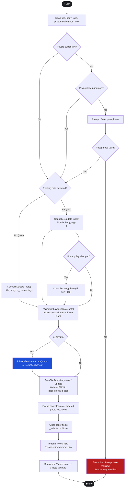
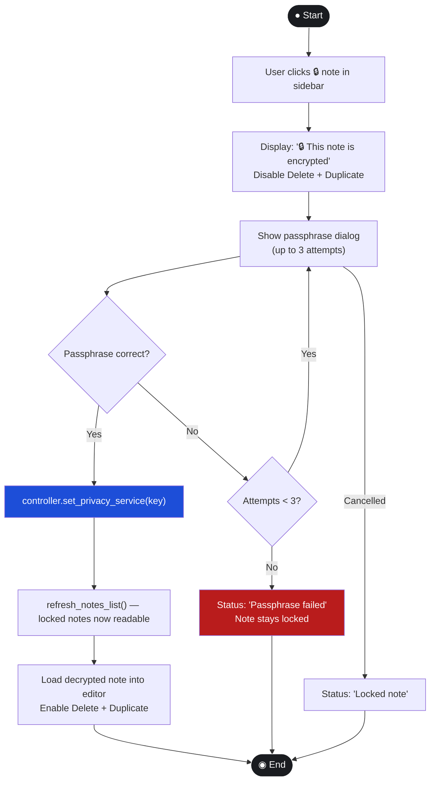

# Activity Diagram — AstraNotes

## Activity 1: Save Note (FR-01 / FR-02 / FR-04 / SPR-01)

This is the primary workflow. Every node has exactly one entry path;
the diagram starts at ● and ends at ◉.



---

## Activity 2: Search Notes (FR-07)

```mermaid
flowchart TD
    S2(["● Start"])
    KeyRelease["User types in search box\n(KeyRelease event)"]
    GetKeyword["Read keyword from entry widget"]
    IsBlank{Keyword blank?}
    CallListAll["controller.list_all_for_display()\n→ all notes (locked shown as 🔒)"]
    CallSearch["controller.search_notes(keyword)"]
    IterNotes["For each note in results"]
    IsPrivate{note.is_private?}
    HasKey{privacy key set?}
    Decrypt["PrivacyService.decrypt(body)"]
    DecryptFail{Decrypt failed?}
    SkipNote["Skip note\nlog error"]
    MatchKeyword{keyword in title.lower()\nor body.lower()?}
    Collect["Append to match list"]
    RenderSidebar["Render sidebar items\n(🔒 for locked notes)"]
    E2(["◉ End"])

    S2 --> KeyRelease --> GetKeyword --> IsBlank
    IsBlank -- Yes (show all) --> CallListAll --> RenderSidebar
    IsBlank -- No --> CallSearch --> IterNotes
    IterNotes --> IsPrivate
    IsPrivate -- Yes --> HasKey
    HasKey -- No --> SkipNote
    HasKey -- Yes --> Decrypt --> DecryptFail
    DecryptFail -- Yes --> SkipNote
    DecryptFail -- No --> MatchKeyword
    IsPrivate -- No --> MatchKeyword
    MatchKeyword -- Yes --> Collect --> IterNotes
    MatchKeyword -- No --> IterNotes
    SkipNote --> IterNotes
    IterNotes -- done --> RenderSidebar --> E2

    style S2 fill:#1a1c20,color:#fff,stroke:#fff
    style E2 fill:#1a1c20,color:#fff,stroke:#fff
    style SkipNote fill:#b91c1c,color:#fff
    style Decrypt fill:#1d4ed8,color:#fff
```

---

## Activity 3: Unlock Passphrase on Locked Note Click (SPR-04)


