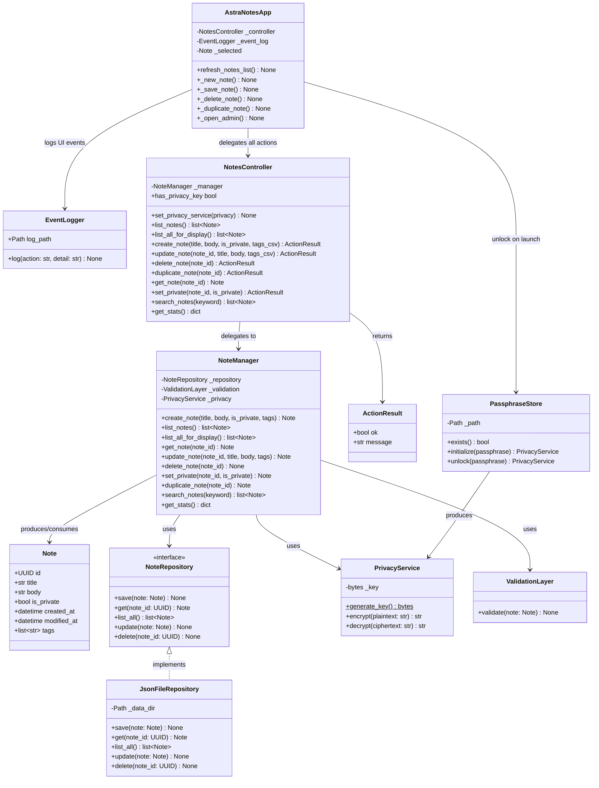

# Class Diagram — AstraNotes

Rendered with [Mermaid](https://mermaid.js.org/) (GitHub renders automatically).

## Tier Boundaries

| Tier | Package | Key Classes |
|------|---------|-------------|
| Presentation | `astranotes.gui` | `AstraNotesApp`, `NotesController`, `EventLogger` |
| Logic | `astranotes.services` | `NoteManager`, `PrivacyService`, `ValidationLayer` |
| Data | `astranotes.repositories`, `astranotes.models` | `JsonFileRepository`, `Note` |
