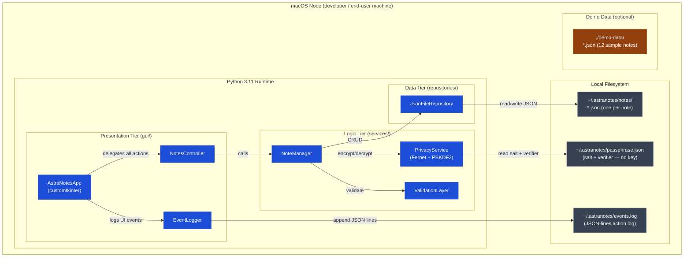

# Deployment Diagram — AstraNotes



## Deployment Notes

| Artefact | Location | Notes |
|----------|----------|-------|
| Application source | `~/Documents/astranotes-project/` | Git-tracked |
| Installed package | `venv/` (editable install via `pip install -e .`) | Not committed |
| Note store | `~/.astranotes/notes/*.json` | Not committed |
| Passphrase verifier | `~/.astranotes/passphrase.json` | Not committed |
| Event log | `~/.astranotes/events.log` | Not committed |
| Demo data | `./demo-data/` | Committed (encrypted payloads only; passphrase is a CLI arg) |
| Mac app bundle | `~/Desktop/AstraNotes.app` | Shell-script launcher; not committed |

## CI/CD Deployment (GitHub Actions)

```
push → .github/workflows/ci.yml
         ├── test job    (pytest, Python 3.11 + 3.12)
         ├── security    (bandit SAST scan)
         └── lint        (ruff)
```

No production server or network deployment — AstraNotes is local-first by design.
