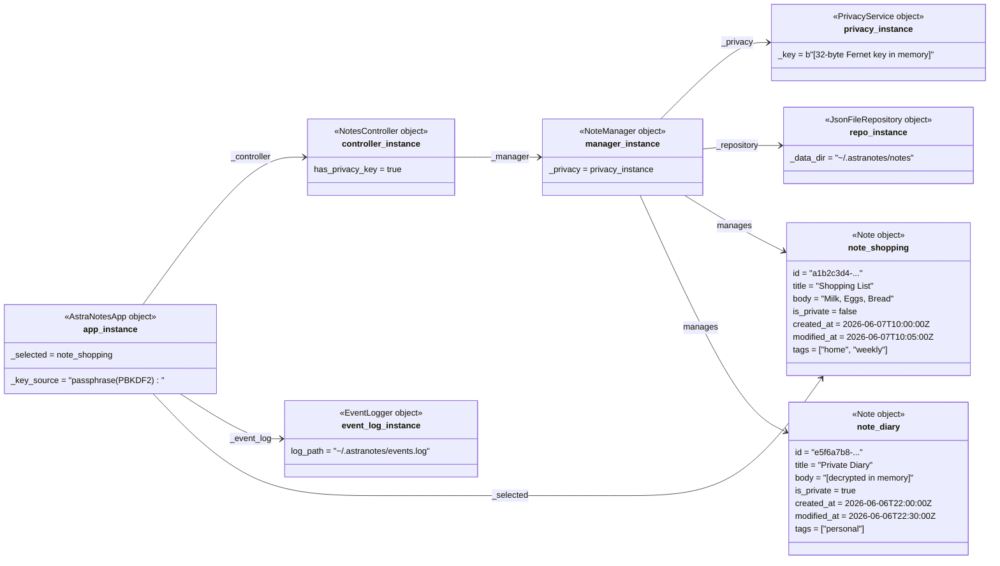

# Object Diagram — AstraNotes (demo session snapshot)

Shows concrete runtime instances during a demo session with two notes loaded.

> **Note:** `note_diary.body` is stored as Fernet ciphertext on disk.  
> It only appears as plaintext in this in-memory object after decryption.
