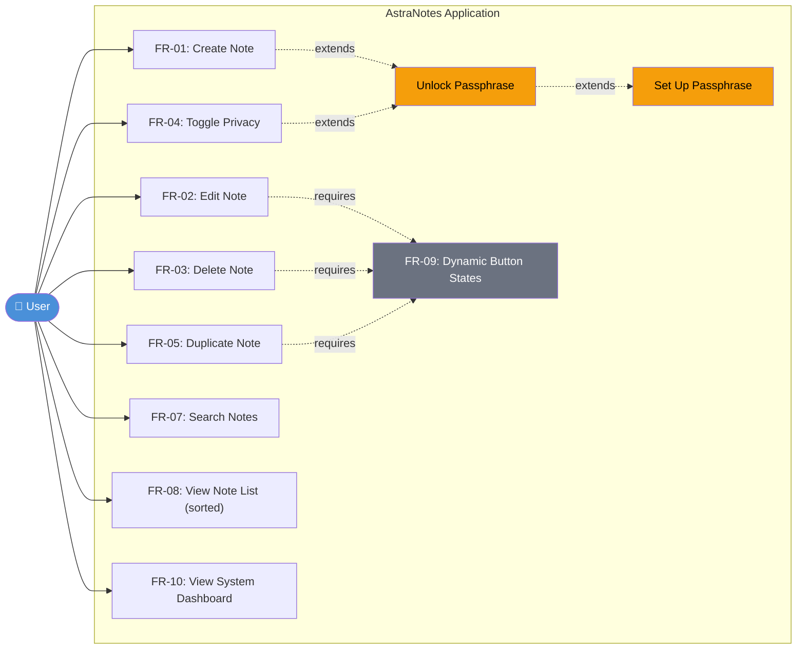

# Use Case Diagram — AstraNotes

## Use Case Descriptions

| ID | Use Case | Actor | Pre-condition | Main Flow | Post-condition |
|----|----------|-------|---------------|-----------|----------------|
| UC1 | **Create Note** | User | App running | Enter title; optionally body, tags, private flag; click Save | Note persisted; list refreshed |
| UC2 | **Edit Note** | User | Note selected (not locked) | Modify fields; click Save | Note updated; `modified_at` advanced |
| UC3 | **Delete Note** | User | Note selected | Click Delete (enabled) | Note removed; list refreshed |
| UC4 | **Toggle Privacy** | User | Note selected | Toggle "Private" switch; Save | Body re-encrypted or decrypted on disk |
| UC5 | **Duplicate Note** | User | Note selected | Click Duplicate | Copy with "Copy of …" title created |
| UC6 | **Search Notes** | User | — | Type keyword in search box | Matching notes displayed live |
| UC7 | **View Note List** | User | — | Open app | Notes sorted by `modified_at` desc; locked notes show 🔒 |
| UC8 | **System Dashboard** | User | — | Click System button | Live stats popup: note count, storage, encryption status |
| UC9 | **Unlock Passphrase** | User | `passphrase.json` exists | Enter passphrase in dialog | Encryption key loaded into memory |
| UC10 | **Set Up Passphrase** | User | No passphrase configured | Enter + confirm passphrase | Salt + verifier written to `passphrase.json`; key in memory |
| UC11 | **Dynamic Buttons** | System | — | Note selection changes | Delete/Duplicate enabled iff note selected |
